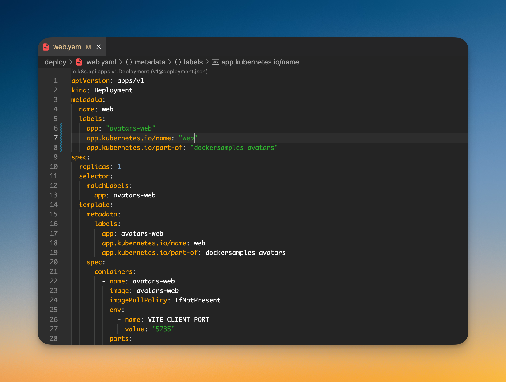

# Fulgora Visual Studio Code theme

A theme extension for [Visual Studio Code](https://code.visualstudio.com/) designed specifically for DevOps professionals, optimizing the development and operational workflow with a focus on clarity, efficiency, and seamless integration with daily tools.

## Screenshots

## Changelog

See [CHANGELOG.md](CHANGELOG.md)

## Intellij IDEA color scheme

If you are looking Intellij IDEA thema you will find it on this [VS Code theme plugin](https://github.com/pnowy/fulgora/blob/main/fulgora.icls).

**Enjoy!**
